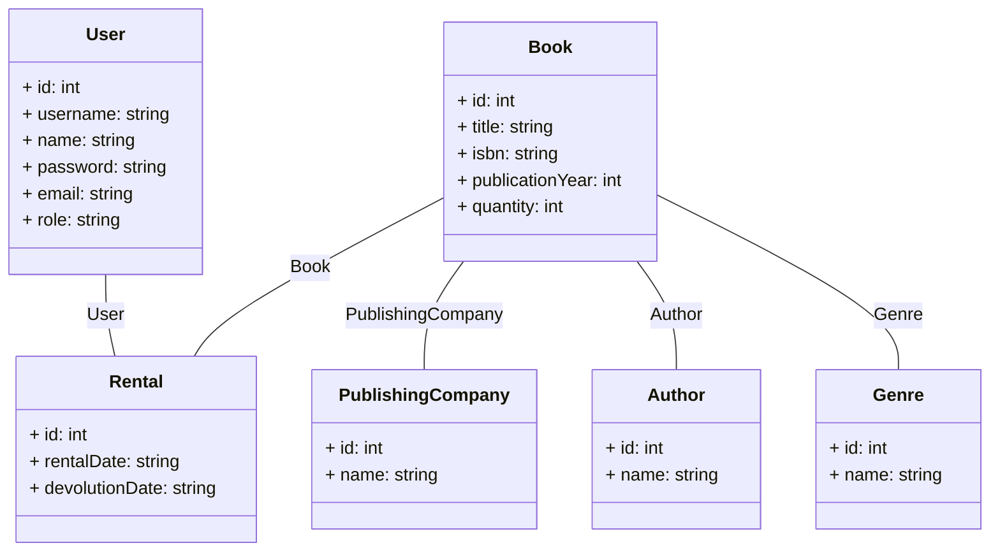

# toplibrary
Gerenciador de biblioteca

## Diagrama de classes

```mermaid
classDiagram
  class User {
    + id: int
    + username: string
    + name: string
    + password: string
    + email: string
    + role: string
  }

  class Book {
    + id: int
    + title: string
    + isbn: string
    + publicationYear: int
    + quantity: int
  }

  class PublishingCompany {
    + id: int
    + name: string
  }

  class Author {
    + id: int
    + name: string
  }

  class Genre {
    + id: int
    + name: string
  }

  class Rental {
    + id: int
    + rentalDate: string
    + devolutionDate: string
  }

  User -- Rental : User
  Book -- Rental : Book
  Book -- PublishingCompany : PublishingCompany
  Book -- Author : Author
  Book -- Genre : Genre

```
