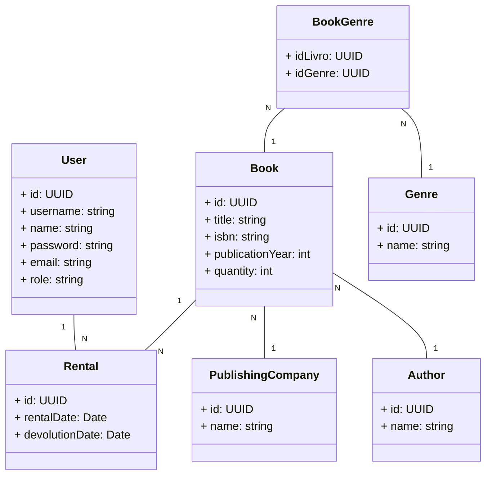

# Top Library
Gerenciador de biblioteca

## Diagrama de classes

```mermaid
classDiagram
  class User {
    + id: UUID
    + username: string
    + name: string
    + password: string
    + email: string
    + role: string
  }

  class Book {
    + id: UUID
    + title: string
    + isbn: string
    + publicationYear: int
    + quantity: int
  }

  class PublishingCompany {
    + id: UUID
    + name: string
  }

  class Author {
    + id: UUID
    + name: string
  }

  class Genre {
    + id: UUID
    + name: string
  }
  
  class BookGenre {
      + idLivro: UUID
      + idGenre: UUID
  }

  class Rental {
    + id: UUID
    + rentalDate: Date
    + devolutionDate: Date
  }

  User "1" -- "N" Rental
  Book "1" -- "N" Rental
  Book "N" -- "1" PublishingCompany
  Book "N" -- "1" Author
  BookGenre "N" -- "1" Book
  BookGenre "N" -- "1" Genre
```
